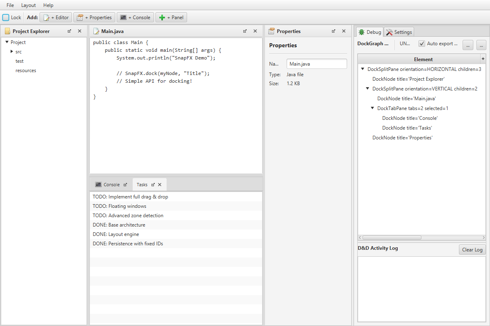

# SnapFX - Lightweight JavaFX Docking Framework

<p align="center">
  
</p>

A high-performance, lightweight JavaFX docking framework that behaves like native professional software (IntelliJ, Visual Studio).

**Note**: SnapFX is a Java Module (JPMS). Make sure your project is configured accordingly.

## MainDemo Preview



## Documentation Map

| File | Purpose |
|------|---------|
| `README.md` | Entry point, feature overview, and quick start |
| `SETUP.md` | Local development environment setup |
| `ARCHITECTURE.md` | Technical architecture and design |
| `STATUS.md` | Current state and open issues |
| `ROADMAP.md` | Planned work and future priorities |
| `DONE.md` | Completed milestones and delivered capabilities |
| `CHANGELOG.md` | Versioned release history grouped by tags |
| `TESTING_POLICY.md` | Stable testing rules and quality gates |
| `CONTRIBUTING.md` | Contribution workflow, branch strategy, and PR checklist |
| `RELEASING.md` | Maintainer release process, versioning, tags, and CI release flow |
| `AGENTS.md` | Collaboration and workflow rules for AI agents |

## Features

### Core Architecture
- **Tree-Based Model**: Logical structure (DockGraph) decoupled from the visual representation
- **Minimal Wrapper**: Simple API `SnapFX.dock(myNode, "Title")`
- **Smart Splitting**: Automatic flattening when orientation matches
- **Auto-Cleanup**: Empty containers remove themselves automatically
- **Java Module**: Full support for Java Platform Module System (JPMS)

### Visual Features
- **Drag & Drop**: Global drag service with visual feedback
- **Dock Zones**: 5 zones (Top, Bottom, Left, Right, Center)
- **Floating Windows**: Custom undecorated floating windows with attach/maximize/restore/close controls
- **Cross-Window D&D**: Dock nodes between main layout and floating windows, including split/tab targets
- **Quick Float Actions**: Float buttons in title bars and tab headers
- **Context Menus**: Right-click actions for tabs, splitters, dock headers, and floating title bars (`Attach to Layout`, always-on-top toggle)
- **Resizable Floating Windows**: Resize from edges and corners (undecorated behavior)
- **Locked Mode**: Lock the layout; no D&D; no close buttons
- **Configurable Keyboard Shortcuts**: Default actions (`Ctrl+W`, `Ctrl+Tab`, `Ctrl+Shift+Tab`, `Escape`, `Ctrl+Shift+P`) can be remapped or disabled via API
- **Title Bar Modes**: ALWAYS/NEVER/AUTO; AUTO hides title bars for tabbed nodes to save space, so those nodes are moved via tabs only (pairs well with compact/locked layouts)

### Persistence
- **Layout Save/Load**: JSON-based serialization
- **Full Structure**: Positions and split percentages
- **Runtime Floating Memory**: Float/attach toggles preserve last floating bounds per node in-session

### Look & Feel
- **Native Look**: Seamless integration with the JavaFX Modena theme
- **CSS-based**: Fully customizable

## Quick Start

Maven Central dependency coordinates will be documented here once the first Maven Central release is published.

### Simple Example

```java
import com.github.beowolve.snapfx.SnapFX;
import javafx.application.Application;
import javafx.scene.Scene;
import javafx.scene.control.TextArea;
import javafx.stage.Stage;

public class SimpleDemo extends Application {
    @Override
    public void start(Stage stage) {
        SnapFX snapFX = new SnapFX();

        // Dock nodes
        snapFX.dock(new TextArea("Editor 1"), "Editor");
        snapFX.dock(new TextArea("Console"), "Console");

        // Build layout
        Scene scene = new Scene(snapFX.buildLayout(), 800, 600);
        scene.getStylesheets().add(getClass().getResource("/snapfx.css").toExternalForm());

        stage.setScene(scene);
        snapFX.initialize(stage);
        stage.show();
    }
}
```

### Advanced Usage

```java
// Create nodes with custom IDs (required for cross-session persistence)
DockNode editor = new DockNode("mainEditor", new TextArea(), "Editor");
DockNode console = new DockNode("console", new TextArea(), "Console");
DockNode sidebar = new DockNode("projectExplorer", new TreeView<>(), "Files");

// Dock nodes at specific positions
snapFX.getDockGraph().setRoot(editor);
snapFX.getDockGraph().dock(console, editor, DockPosition.BOTTOM);
snapFX.getDockGraph().dock(sidebar, editor, DockPosition.LEFT);

// Add as tab
DockNode tasks = new DockNode("tasks", new ListView<>(), "Tasks");
snapFX.getDockGraph().dock(tasks, console, DockPosition.CENTER);

// Lock layout
snapFX.setLocked(true);

// Override framework shortcut defaults (or clear with snapFX.clearShortcut(...))
snapFX.setShortcut(
    DockShortcutAction.CLOSE_ACTIVE_NODE,
    new KeyCodeCombination(KeyCode.Q, KeyCombination.SHORTCUT_DOWN)
);

// Move a node to a floating window and attach it back later
DockFloatingWindow floating = snapFX.floatNode(console);
snapFX.attachFloatingWindow(floating);

// Setup factory for save/load across sessions
snapFX.setNodeFactory(nodeId -> switch(nodeId) {
    case "mainEditor" -> new DockNode(nodeId, new TextArea(), "Editor");
    case "console" -> new DockNode(nodeId, new TextArea(), "Console");
    case "projectExplorer" -> new DockNode(nodeId, new TreeView<>(), "Files");
    case "tasks" -> new DockNode(nodeId, new ListView<>(), "Tasks");
    default -> null;
});

// Save/load layout (works across application restarts)
String json = snapFX.saveLayout();
Files.writeString(Path.of("layout.json"), json);

// Later session:
String json = Files.readString(Path.of("layout.json"));
try {
    snapFX.loadLayout(json); // Factory recreates nodes from IDs
} catch (DockLayoutLoadException e) {
    // Handle invalid/corrupt layout JSON.
}
```

## Architecture

Technical internals and component structure are documented in `ARCHITECTURE.md`.

## Testing

Run the full test suite:

```bash
./gradlew test
```

Testing rules and merge gates are defined in `TESTING_POLICY.md`.
Current health and validation snapshots are tracked in `STATUS.md`.
Versioned release history per tag is tracked in `CHANGELOG.md`.

## Demo Application

A full demo app is included:

```bash
./gradlew run
```

The demo shows:
- Typical IDE layout (sidebar, editor, console)
- Lock/unlock functionality
- Save/load layout
- Multiple tabs
- Floating/attach workflows from menu, title bars, and tab headers
- App-level `F11` fullscreen shortcut example

### Update Preview Screenshot

```bash
# Regenerate README preview image from the current MainDemo UI
./scripts/update-main-demo-preview.ps1
```

Optional output path:

```bash
./scripts/update-main-demo-preview.ps1 -OutputPath "docs/images/main-demo.png"
```

## Example Layouts

### IDE Layout
```
┌─────────────┬──────────────────────┬─────────────┐
│   Project   │       Editor         │ Properties  │
│   Explorer  │                      │             │
│             ├──────────────────────┤             │
│             │   Console | Tasks    │             │
└─────────────┴──────────────────────┴─────────────┘
```

### Code with SnapFX
```java
DockNode project = snapFX.dock(projectTree, "Project");
DockNode editor = snapFX.dock(editorArea, "Editor", project, DockPosition.RIGHT);
DockNode props = snapFX.dock(propsPanel, "Properties", editor, DockPosition.RIGHT);
DockNode console = snapFX.dock(consoleArea, "Console", editor, DockPosition.BOTTOM);
DockNode tasks = snapFX.dock(tasksList, "Tasks", console, DockPosition.CENTER);
```

## Roadmap

Planned work is tracked in `ROADMAP.md`.

## License

This project is licensed under the MIT License.

SnapFX is intended for personal and commercial use, including large applications.

## Contributing

For contribution workflow, branch strategy, commit/PR expectations, and quality gates, see `CONTRIBUTING.md`.

For maintainer release/versioning/tag flow, see `RELEASING.md`.

## Documentation

See JavaDoc in the source files and `ARCHITECTURE.md` for detailed framework internals.

## Technology Stack

- **Java 21+**
- **JavaFX 21+**
- **Gson** (JSON serialization)
- **JUnit 5 / TestFX** (testing)
- **Gradle** (build)

## Support

If you have questions or issues, open an issue in the repository.

---

**SnapFX** - Making JavaFX Docking Simple and Powerful
