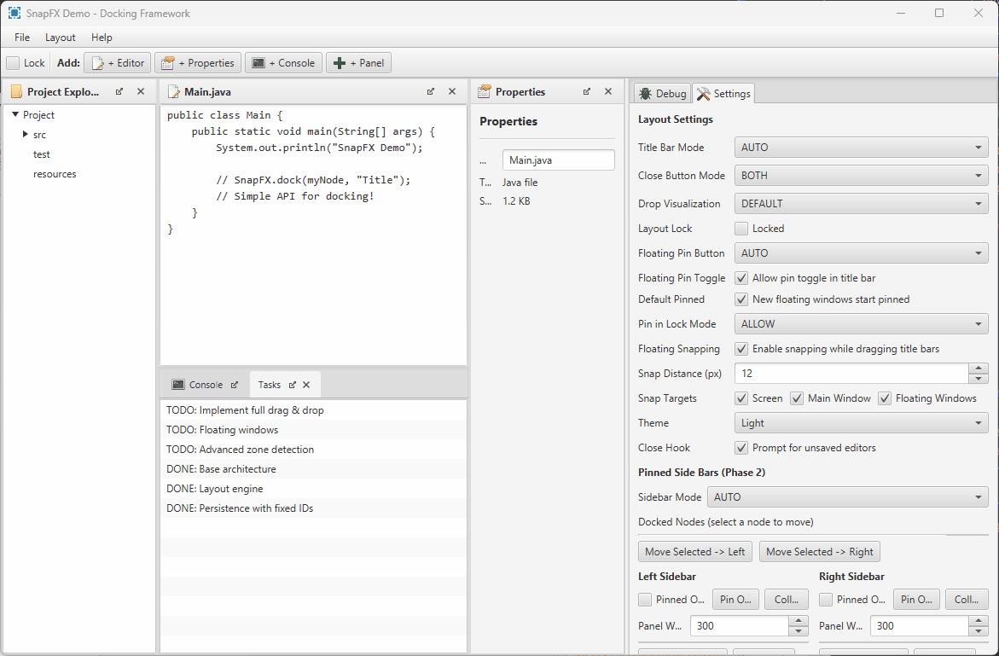
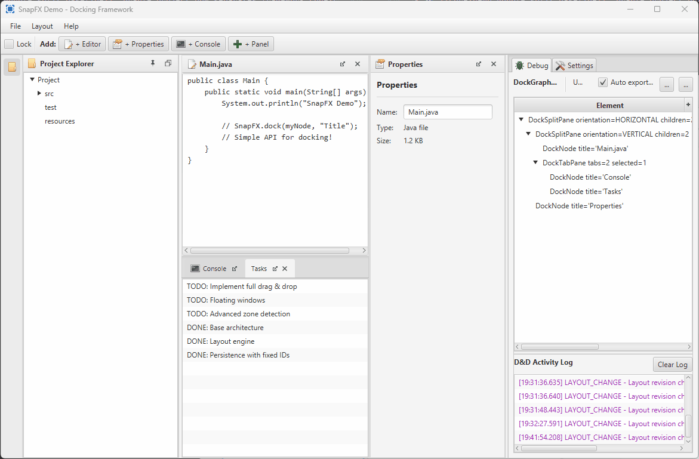

# SnapFX Animated GIF Showcase

This page collects animated GIFs that demonstrate key SnapFX interactions.
Update this file whenever new feature-focused GIFs are added to `docs/images/`.

## Main Demo Overview

## Feature GIFs

### Drag and Drop

Shows drag-and-drop interactions across the main layout.

### Side Bars

Shows side-bar workflows including docking to/from side bars.

### Snapping and Themes

Shows floating-window snapping behavior and theme switching.

## Maintenance Notes

- Keep GIF filenames descriptive and stable once linked.
- Prefer focused, short recordings per feature area.
- Re-run preview generation tasks when `MainDemo` visuals change.
